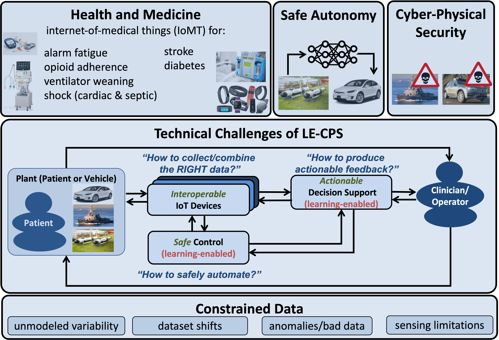

## Learning-Enabled Cyber-Physical Systems

My research aims to develop techniques and tools for the design and analysis of learning-enabled cyber-physical
systems (LE-CPS) with thin data primarily targeting applications in the internet-of-medical-things (IoMT)
and autonomous vehicles (AVs). These systems present a unique combination of challenges stemming from the
intersection of data science, embedded systems, and cyber-physical security in healthcare and autonomy
applications -- challenges that are not well handled by existing robust engineering paradigms. To address these
challenges, my research aims to develop novel design and analysis techniques for (i) interoperable IoT devices,
(ii) actionable decision support, and (iii) safe learning-enabled control. Maximizing the impact of my research
requires an interdisciplinary approach - thus, I openly collaborate with medical professionals and industry to
transition my research into practice.

### What are the technical challenges of LE-CPS?  

Traditional cyber-physical systems (CPS) are safety-critical embedded systems that feature tight coupling
between communication and computation used to control complex, dynamic, and uncertain physical/physiological plants.
Learning-enabled CPS (LE-CPS) additionally incorporate components whose behavior is driven by "background knowledge"
acquired and updated through a "learning process". The design and analysis of LE-CPS presents multiple technical
challenges. First, the data collection process requires identifying and collecting the right data for learning.
Second, assuring safety necessitates the ability to provide actionable feedback to clinicans/human operators in
situations where confidence in learning degrades. Third, closing-the-loop with learning-enabled components presents
challenges for safety and security assurance. 

### What is "thin data"?

While empirical data is often a significant source of this background knowledge in LE-CPS, it can also be limited,
sparse, or "thin" due to unmodeled variability, dataset shifts, anomalies, and sensing constraints. Consequently,
providing safety guarantees and predictable performance in learning-enabled CPS with thin data is challenging. My
research addresses the challenges of thin data by incorporating additional sources of background knowledge including
physical/physiological models and contextual information. In healthcare, my work utilizes new sensing modalities
as well as physiological and contextual information to overcome thin data challenges stemming from inter/intra-patient
variability, constrained sensing and actuation capabilities, limited and protected patient populations, and uncertain
models of multi-system physiology. Similarly in autonomy, my research utilizes physical models to enable operation in
time-varying, uncertain, unstructured, and adversarial environments.

### Current Projects
- [Momitor: Wearable Technology for Early Detection of Postpartum Hemorrhage (NIH STTR)](https://reporter.nih.gov/search/y7_IQE9dSECym8C5PO0xzg/project-details/10483278)
- [SCC-IRG JST: Active sensing and personalized interventions for pandemic-induced social isolation (NSF SCC)](https://www.nsf.gov/awardsearch/showAward?AWD_ID=2125561&HistoricalAwards=false)
- [Robust Concept Learning and Lifelong adaptation against adversarial attacks (ARO MURI)](https://aro-muri2020.seas.upenn.edu/index.html)
- [AutoWean: Foundations of Autonomous Medical CPS for Mechanical Ventilation Weaning (NIH RO1)](https://projectreporter.nih.gov/project_info_description.cfm?aid=9985370&icde=47046182&ddparam=&ddvalue=&ddsub=&cr=1&csb=default&cs=ASC&pball=)
- [Monitoring safety and adherence of pain management through remote opioid sensing and analysis (NIH R01)](https://projectreporter.nih.gov/project_info_description.cfm?aid=9936691&icde=47034448)
- [Smart Alarms 2.0: Foundations for Caregiver-in-the-loop Suppression of Non-Informative Alarms (NSF SCH)](https://www.nsf.gov/awardsearch/showAward?AWD_ID=1915398&HistoricalAwards=false)
- [Pediatric Patient Safety Learning Laboratory to Re-Engineer Continuous Physiologic Monitoring Systems (NIH R18)](https://projectreporter.nih.gov/project_info_description.cfm?aid=9778806&icde=47047062)
- [Integrated Static and Dynamic Approaches to High-Assurance for Learning-Enabled Cyber-Physical Systems (DARPA Assured Autonomy)](https://rtg.cis.upenn.edu/assured-autonomy/)